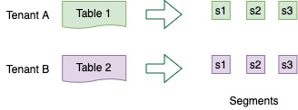

# Tenant

Every table is associated with a _tenant_, or a logical namespace that restricts where the cluster processes queries on the table. A Pinot tenant takes the form of a text tag in the logical tenant namespace. Physical cluster hardware resources (i.e., [brokers](components/cluster/broker.md) and [servers](components/cluster/server.md)) are also associated with a tenant tag in the common tenant namespace. Tables of a particular tenant tag will only be scheduled for storage and query processing on hardware resources that belong to the same tenant tag. This lets Pinot cluster operators assign specified workloads to certain hardware resources, preventing data in separate workloads from being stored or processed on the same physical hardware.

By default, all tables, brokers, and servers belong to a tenant called _DefaultTenant_, but you can configure multiple tenants in a Pinot cluster.

To support multi-tenancy, Pinot has first-class support for tenants. Every table is associated with a server tenant and a broker tenant, which controls the nodes used by the table as servers and brokers. Multi-tenancy lets Pinot group all tables belonging to a particular use case under a single tenant name.

The concept of tenants is very important when the multiple use cases are using Pinot and there is a need to provide quotas or some sort of isolation across tenants. For example, consider we have two tables `Table A` and `Table B` in the same Pinot cluster.



We can configure `Table A` with server tenant `Tenant A` and `Table B` with server tenant `Tenant B`. We can tag some of the server nodes for `Tenant A` and some for `Tenant B`. This will ensure that segments of `Table A` only reside on servers tagged with `Tenant A`, and segment of `Table B` only reside on servers tagged with `Tenant B`. The same isolation can be achieved at the broker level, by configuring broker tenants to the tables.


&#x20;No need to create separate clusters for every table or use case!&#x20;

## Tenant configuration

This tenant is defined in the [tenants](../table/#tenants) section of the table config.&#x20;

This section contains two main fields `broker` and `server` , which decide the tenants used for the broker and server components of this table.

```javascript
"tenants": {
  "broker": "brokerTenantName",
  "server": "serverTenantName"
}
```

In the above example:

* The table will be served by brokers that have been tagged as `brokerTenantName_BROKER` in Helix.
* If this were an offline table, the offline segments for the table will be hosted in Pinot servers tagged in Helix as `serverTenantName_OFFLINE`
* If this were a real-time table, the real-time segments (both consuming as well as completed ones) will be hosted in pinot servers tagged in Helix as `serverTenantName_REALTIME`.

## Create a tenant

### Broker tenant

Here's a sample broker tenant config. This will create a broker tenant `sampleBrokerTenant` by tagging three untagged broker nodes as `sampleBrokerTenant_BROKER`.&#x20;


```javascript
{
     "tenantRole" : "BROKER",
     "tenantName" : "sampleBrokerTenant",
     "numberOfInstances" : 3
}
```


To create this tenant use the following command. The creation will fail if number of untagged broker nodes is less than `numberOfInstances`.



Follow instructions in [Getting Pinot](../../getting-started/running-pinot-locally.md#getting-pinot) to get Pinot locally, and then

```bash
bin/pinot-admin.sh AddTenant \
    -name sampleBrokerTenant 
    -role BROKER 
    -instanceCount 3 -exec
```



```
curl -i -X POST -H 'Content-Type: application/json' -d @sample-broker-tenant.json localhost:9000/tenants
```



Check out the table config in the [Rest API](http://localhost:9000/help#!/Tenant/getAllTenants) to make sure it was successfully uploaded.&#x20;

### Server tenant

Here's a sample server tenant config. This will create a server tenant `sampleServerTenant` by tagging 1 untagged server node as `sampleServerTenant_OFFLINE` and 1 untagged server node as `sampleServerTenant_REALTIME`.&#x20;


```javascript
{
     "tenantRole" : "SERVER",
     "tenantName" : "sampleServerTenant",
     "offlineInstances" : 1,
     "realtimeInstances" : 1
}
```


To create this tenant use the following command. The creation will fail if number of untagged server nodes is less than `offlineInstances` + `realtimeInstances`.



Follow instructions in [Getting Pinot](../../getting-started/running-pinot-locally.md#getting-pinot) to get Pinot locally, and then

```bash
bin/pinot-admin.sh AddTenant \
    -name sampleServerTenant \
    -role SERVER \
    -offlineInstanceCount 1 \
    -realtimeInstanceCount 1 -exec
```



```
curl -i -X POST -H 'Content-Type: application/json' -d @sample-server-tenant.json localhost:9000/tenants
```



Check out the table config in the [Rest API](http://localhost:9000/help#!/Tenant/getAllTenants) to make sure it was successfully uploaded.&#x20;
