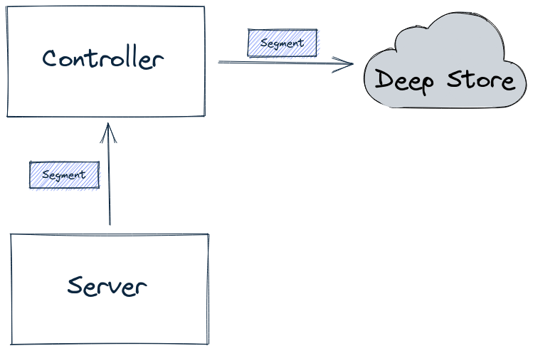

# Deep Store

The deep store (or deep storage) is the permanent store for [segment](segment.md) files.

It is used for backup and restore operations. New [server](server.md) nodes in a cluster will pull down a copy of segment files from the deep store. If the local segment files on a server gets damaged in some way (or accidentally deleted), a new copy will be pulled down from the deep store on server restart.

The deep store stores a compressed version of the segment files and it typically won't include any indexes. These compressed files can be stored on a local file system or on a variety of other file systems. For more details on supported file systems, see [File Systems](../data-import/pinot-file-system/).

<mark style="color:red;">Note:</mark> Deep Store by itself is not sufficient for restore operations. Pinot stores metadata such as table config, schema, segment metadata in Zookeeper. For restore operations, both Deep Store as well as Zookeeper metadata are required.

## How do segments get into the Deep Store?

There are several different ways that segments are persisted in the deep store.

For offline tables, the batch ingestion job writes the segment directly into the deep store, as shown in the diagram below:

.png>)

The ingestion job then sends a notification about the new segment to the controller, which in turn notifies the appropriate server to pull down that segment.

For real-time tables, by default, a segment is first built-in memory by the server. It is then uploaded to the lead controller (as part of the Segment Completion Protocol sequence), which writes the segment into the deep store, as shown in the diagram below:

Having all segments go through the controller can become a system bottleneck under heavy load, in which case you can use the peer download policy, as described in [Decoupling Controller from the Data Path](../../operators/operating-pinot/decoupling-controller-from-the-data-path.md).

When using this configuration the server will directly write a completed segment to the deep store, as shown in the diagram below:

## Configuring the Deep Store

For hands-on examples of how to configure the deep store, see the following tutorials:

* [Use OSS as Deep Storage for Pinot](../../users/tutorials/use-oss-as-deep-storage-for-pinot.md)
* [Use S3 as Deep Storage for Pinot](../../users/tutorials/use-s3-as-deep-store-for-pinot.md)
