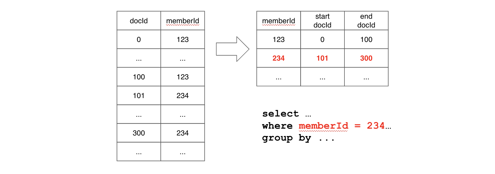

# Inverted Index

We can define the [forward index](./forward-index.md) as a relation from document ids (a.k.a. rows) to values.
In a similar way, an inverted index is a relation from values to a set of document ids.
Therefore they are the _inverted_ version of the forward index.
If you have a column that is frequently used for filtering by EQ, IN, GT, etc adding an inverted index will improve performance greatly.

Pinot supports two different inverted indexes: bitmap inverted indexes and sorted inverted indexes.
Bitmap inverted index are the _actual_ inverted index type, while the sorted type is a free index you get when the 
column is sorted.
Both type of indexes require that the [dictionary](dictionary-index.md) is enabled for the column.

### Bitmap inverted index

When the column is not sorted and an inverted index is enabled for a column, Pinot maintains a map from each value to a bitmap of rows, which makes value lookup take constant time.

An inverted index are disabled by default and can be enabled for a column by setting it in the [table config](../../configuration-reference/table.md):


```javascript
{
  "fieldConfigList": [
    {
      "name": "theColumnName",
      "indexes": {
        "inverted": {
          "disabled": false
        }
      }
    }
  ],
  ...
}
```


Note that `"disabled": false` is not actually required. 
The following enables the inverted index too:

```javascript
{
  "fieldConfigList": [
    {
      "name": "theColumnName",
      "indexes": {
        "inverted": {}
      }
    }
  ],
  ...
}
```


The older way to configure inverted indexes can also be used, although it is not actually recommended:


```javascript
{
    "tableIndexConfig": {
        "invertedIndexColumns": [
            "theColumnName",
            ...
        ],
        ...
    }
}
```


#### When the index is created
By default, bitmap inverted indexes are not created when the segment is created but when it is loaded by Pinot.
This is controlled by the table config option `indexingConfig.createInvertedIndexDuringSegmentGeneration`, which 
defaults to false.

### Sorted inverted index

As explained in [forward index](forward-index.md), a column that is sorted and has dictionary is encoded in a special way that can be used to implement both forward and inverted index.
Therefore when these conditions fulfill, an inverted index is created for free, even if the configuration indicates otherwise.
This sorted version of the forward index has a `log(n)` time lookup and it can benefit from data locality.

For the below example, if the query has a filter on `memberId`, Pinot will perform a binary search on `memberId` values to find the range pair of docIds for corresponding filtering value. If the query needs to scan values for other columns after filtering, values within the range docId pair will be located together, which means we can benefit from data locality.



A sorted inverted index performs much better than a bitmap inverted index, but it can only be applied to sorted columns. When the query performance with an inverted index is not good enough and most queries are filtering on the same column (e.g. _memberId_), a sorted index can improve the query performance.
