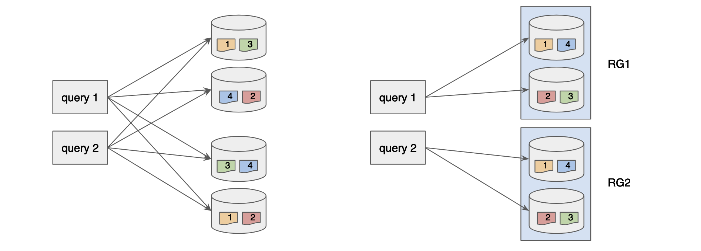

# Routing

## Optimizing Scatter and Gather

When the use case has very high qps along with low latency requirements (usually site facing use cases), we need to consider optimizing the scatter-and-gather.

Below table summarizes the two issues with the default behavior of Pinot.

| Problem               | Impact                         | Solution                                 |
| --------------------- | ------------------------------ | ---------------------------------------- |
| Querying all servers  | Bad tail latency, not scalable | Control the number of servers to fan out |
| Querying all segments | More CPU work on server        | Minimize the number of segment           |

### Querying All Servers

By default, Pinot uniformly distributes all the segments to all servers of a table. When scatter-and-gathering query requests, broker also uniformly distributes the workload among servers for each segment. As a result, each query will span out to all servers with balanced workload. It works pretty well when qps is low and you have a small number of servers in the cluster. However, as we add more servers or have more qps, the probability of hitting slow servers (e.g. gc) increases steeply and Pinot will suffer from a long tail latency.

In order to address this issue, we have introduced a concept of `Replica Group`, which allows us to control the number of servers to fan out for each query.

#### Replica Group Segment Assignment and Query Routing

`Replica Group` is a set of servers that contains a ‘complete’ set of segments of a table. Once we assign the segment based on replica group, each query can be answered by fanning out to a single replica group instead of all servers.



`Replica Group` can be configured by setting the `InstanceAssignmentConfig` in the table config. Replica group based routing can be configured by setting `replicaGroup` as the `instanceSelectorType` in the `RoutingConfig`.

```
{
  ...
  "instanceAssignmentConfigMap": {
    "OFFLINE": {
      ...
      "replicaGroupPartitionConfig": {
        "replicaGroupBased": true,
        "numReplicaGroups": 3,
        "numInstancesPerReplicaGroup": 4
      }
    }
  },
  ...
  "routing": {
    "instanceSelectorType": "replicaGroup"
  },
  ...
}
```

As seen above, you can use `numReplicaGroups` to control the number of replica groups (replications), and use `numInstancesPerReplicaGroup` to control the number of servers to span. For instance, let’s say that you have 12 servers in the cluster. Above configuration will generate 3 replica groups (`numReplicaGroups=3`), and each replica group will contain 4 servers (`numInstancesPerPartition=4`). In this example, each query will span to a single replica group (4 servers).

As you seen above, replica group gives you the control on the number of servers to span for each query. When you try to decide the proper number of `numReplicaGroups` and `numInstancesPerReplicaGroup`, you should consider the trade-off between throughput and latency. Given a fixed number of servers, increasing `numReplicaGroups` factor while decreasing `numInstancesPerReplicaGroup` will give you more throughput because each server requires to process less number of queries. However, each server will need to process more number of segments per query, thus increasing overall latency. Similarly, decreasing `numReplicaGroups` while increasing `numInstancesPerReplicaGroup` will make each server processing more number of queries but each server needs to process less number of segments per query. So, this number has to be decided based on the use case requirements.

### Querying All Segments

By default, Pinot broker will distribute all segments for query processing and segment pruning is happening in Server. In other words, Server will look at the segment metadata such as min/max time value and discard the segment if it does not contain any data that the query is asking for. Server side pruning works pretty well when the qps is low; however, it becomes the bottleneck if qps is very high (hundreds to thousands queries per second) because unnecessary segments still need to be scheduled for processing and consume cpu resources.

Currently, we have two different mechanisms to prune segments on the broker side to minimize the number of segment for processing before scatter-and-gather.

#### Partitioning

When the data is partitioned on a dimension, each segment will contain all the rows with the same partition value for a partitioning dimension. In this case, a lot of segments can be pruned if a query requires to look at a single partition to compute the result. Below diagram gives the example of data partitioned on member id while the query includes an equality filter on member id.


`Partitoning` can be enabled by setting the following configuration in the table config.

```
{
  ...
  "tableIndexConfig": {
    ...
    "segmentPartitionConfig": {
      "columnPartitionMap": {
        "memberId": {
          "functionName": "Modulo",
          "numPartitions": 4
        }
      }
    },
    ...
  },
  ...
  "routing": {
    "segmentPrunerTypes": ["partition"]
  },
  ...
}
```

Pinot currently supports `Modulo`, `Murmur`, `ByteArray` and `HashCode` hash functions. After setting the above config, data needs to be partitioned with the same partition function and number of partitions before running Pinot segment build and push job for offline push. Realtime partitioning depends on the kafka for partitioning. When emitting an event to kafka, a user need to feed partitioning key and partition function for Kafka producer API.

When applied correctly, partition information should be available in the segment metadata.

```
column.memberId.partitionFunction = Module
column.memberId.numPartitions = 4
column.memberId.partitionValues = 1
```

Broker side pruning for partitioning can be configured by setting the `segmentPrunerTypes` in the `RoutingConfig`. Note that the current implementation for partitioning only works for **EQUALITY** and **IN** filter (e.g. `memberId = xx`, `memberId IN (x, y, z)`).
